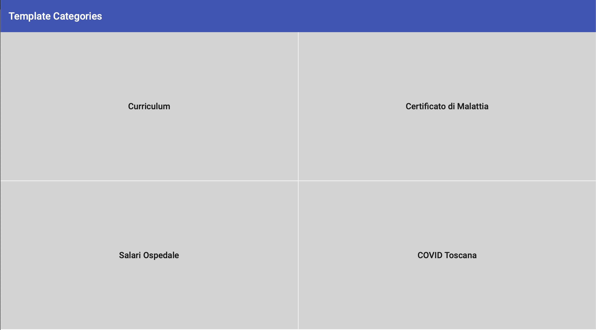
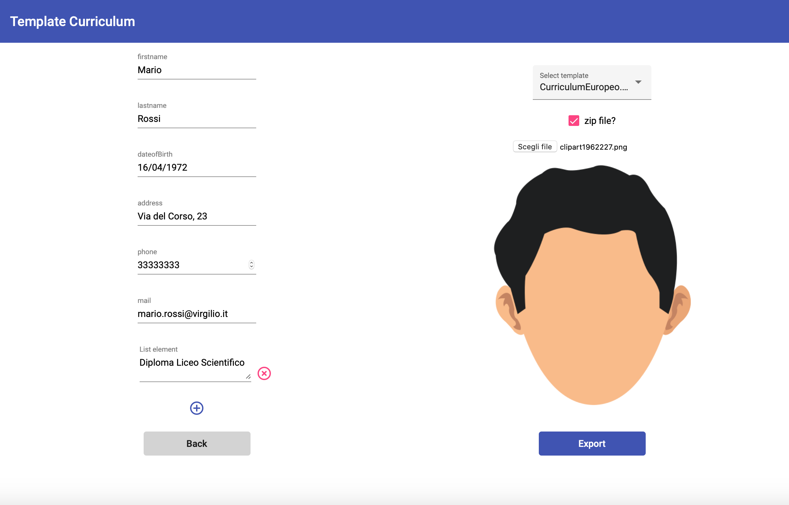
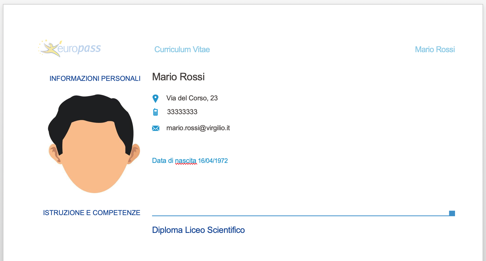

# Export Library - FrontEnd

This project was developed with [Angular CLI](https://github.com/angular/angular-cli) version 10.1.3 and it is the front end of 
[Export Library](https://github.com/freaky1310/ExportLibrary-BackEnd) back end, in collaboration with [freaky1310](https://github.com/freaky1310).
The entire architecture follows the **RESTful** guidelines, front end communicates with back end thanks to `http` calls.

## Main Features

This application helps a user in **document exporting**, in particular with `.docx` and `.xlsx` files. A client, with
this browser application, can choose a form of pre-established category and he can download it as a property final file, 
with right extension.

Inside the back-end application, some templates are stored; these can resolve some common use cases, like 
writing a curriculum or adding some employee salaries in Excel table.

Internally, the back end uses [XDocReport](https://github.com/opensagres/xdocreport) and [Jxls](http://jxls.sourceforge.net).

## Graphic Interface

- In the home page, a client selects the category of interest.
- He compiles the form.
- Client can received the file also in `.zip` format.
- He presses the **export** button to download the filled  final file.

## How to Install

Install all _npm_ dependencies and run the back end.
Run `ng serve` for a dev server. Navigate to `http://localhost:4200/`.

Also make sure to turn on the `-allow-file-access-from-files` flag on 
your browser (with Safari `Disable Local File Restrictions`).

## References

[1] https://github.com/angular/angular-cli

[2] https://github.com/freaky1310/ExportLibrary-BackEnd

[3] https://github.com/opensagres/xdocreport

[4] http://jxls.sourceforge.net

